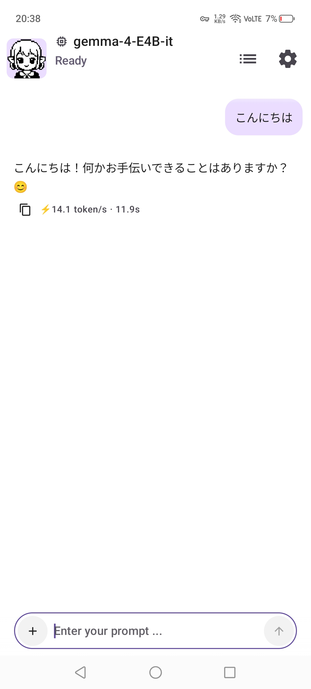
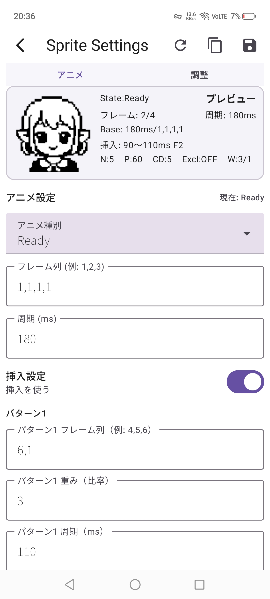
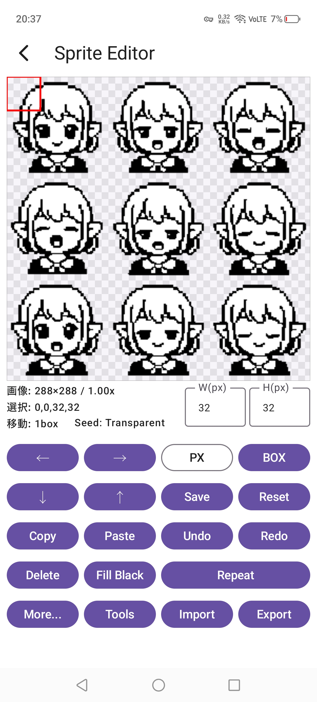
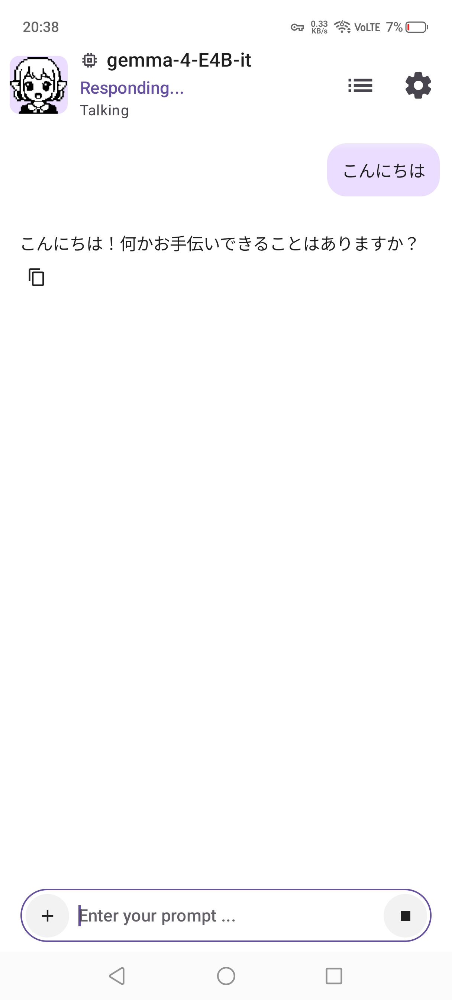
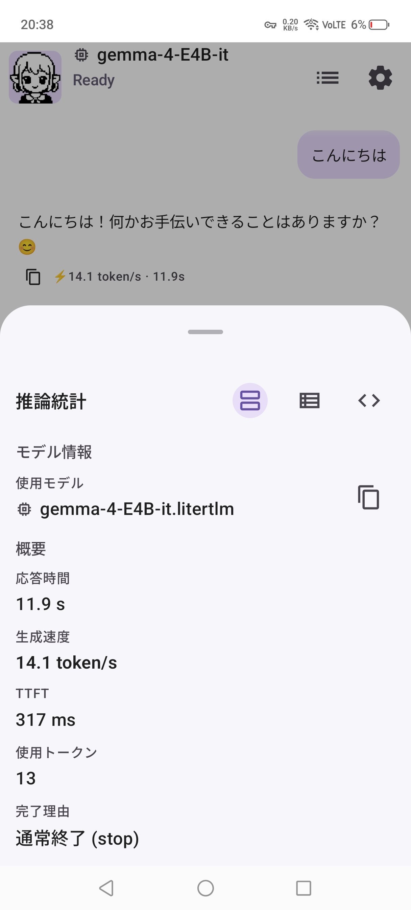
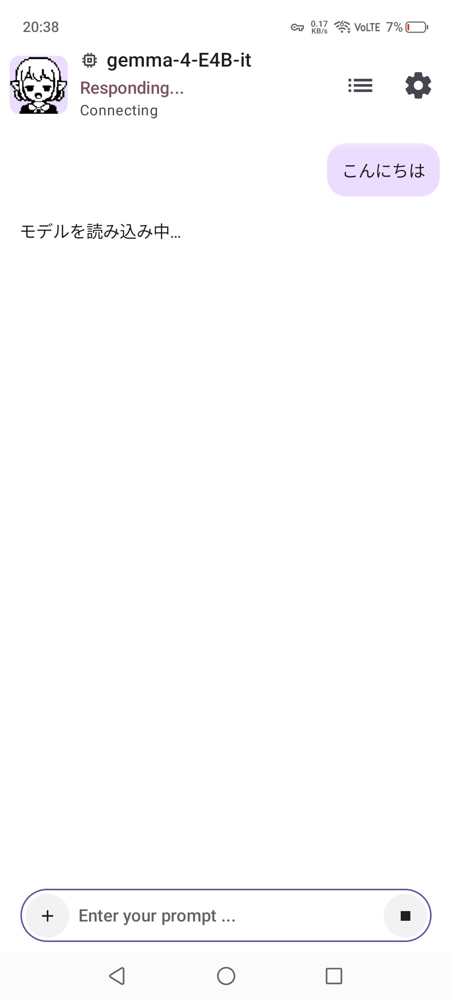

# LAMI Android

[English README](README.md)

LAMI（ラミィ）は、Edge AI、LiteRT、オンデバイス推論、Qualcomm NPU アクセラレーション、表情豊かなスプライトキャラクター、将来的な共有可能AIパーソナリティを重視する Android-first なローカルAIアシスタントプラットフォームです。

## 概要

LAMI は、Android端末上でローカルAIアシスタント体験を作るためのAndroidアプリプロジェクトです。AndroidネイティブのチャットUI、オンデバイス推論、Qualcomm NPU アクセラレーション、キャラクターUI、音声インタラクション、開発者向け診断、将来的な共有可能AIパーソナリティ形式を主な対象にしています。

Ollama連携もサポート対象ですが、LAMIはOllama専用クライアントではありません。Ollamaはバックエンドの1つであり、LiteRT / MediaPipe系ローカルLLM APIや Qualcomm NPU development preview と並ぶ選択肢として扱います。

パッケージ名:

```text
io.github.ninbyo02.lami
```

## Project Scope

LAMIはOllama用UIだけを目的にしたアプリではありません。Android-nativeなローカルAIプラットフォーム方向のプロジェクトとして、Edge AIワークフロー、ローカル推論ランタイム、キャラクター指向のインタラクション、モバイル向け診断を実験・整理していきます。

## 機能

### 実装済み / 利用可能

- Jetpack ComposeベースのAndroidチャットUI
- Ollamaバックエンド連携
- ストリーミング応答UI
- Android Text-to-Speech対応
- **NPU開発検証**としてのSM8750 Qualcomm NPUローカル推論
- UI表示、TTS、DB保存、Markdown、疑似ストリーミングのStandard route契約（Standard Release昇格は未完了）
- ローカル推論連携用のフックとプローブ
- 推論統計と開発者向け診断
- スプライトアニメーションの状態管理とデバッグ設定

### Experimental

- LiteRT / MediaPipe系ローカルLLMフロー
- ローカル推論エンジンの保持とライフサイクル最適化
- tokenizerベースのローカル推論統計
- 文単位のストリーミングTTS
- スプライトアニメーション / デバッグ設定ツール
- GPU Experimental backend
- native token streaming研究

### Planned

- LAMI ASR連携
- ユーザー向けスプライトキャラクターエディタ
- QRによるスプライト / パーソナリティ共有
- 共有可能なローカルAIパーソナリティ形式
- コントリビューションガイドと公開ドキュメントの整理

## Current Focus

- LiteRTローカル推論実験
- Android Edge AIワークフロー
- スプライト状態システムとキャラクターフィードバック
- チャット、ローカル推論、TTS向けのストリーミングUX
- ローカル推論診断とランタイム可視化
- NPU development routeの検証証跡と互換性cleanup

## Why LAMI?

LAMIは次の方向性を重視しています。

- **Local-first:** 可能な範囲で、端末上またはユーザーが管理できる推論経路を優先します。
- **Android-first:** Androidを主な実行環境として扱い、単なるデスクトップ向けサービスの薄いクライアントにはしません。
- **Character-oriented UI:** 表情豊かなスプライトキャラクターとアシスタントの個性をプロダクトの方向性として維持します。
- **Experimental Edge AI direction:** LiteRT、MediaPipe系ローカルLLM API、tokenizerメトリクス、モバイルアクセラレータ経路を検証します。
- **Privacy-conscious direction:** ローカル推論と診断を重視し、不要なデータ移動を減らす設計を目指します。
- **Future AI personality sharing:** スプライトやパーソナリティの概念を、将来的に端末間で共有できる形へ発展させます。

## Design Philosophy

LAMIは、単一の大きなAI機能よりも、小さく理解しやすい要素を積み上げる方針を取ります。Android-nativeなUX、local-firstなワークフロー、キャラクター指向の対話、Edge AI実験をアーキテクチャ上で見える形に保つことを重視します。オフライン対応の方向性、privacy-consciousな挙動、小さく表情豊かなスプライト、共有可能なAIパーソナリティは設計指針であり、すべてのワークフローが完成済みという意味ではありません。

## Why Sprite Characters?

スプライトキャラクターは、Android上でアシスタントの状態を軽量に伝えるための仕組みです。待機中、思考中、発話中、エラー、将来的なパーソナリティ状態などを、重いアバター基盤なしに表現できます。目標は、モバイルUIとして実用的で、将来的にスプライト / パーソナリティ共有形式へ発展できる、感情的に読み取りやすい対話モデルです。

## Edge AI / Local Inference

### Current

- Ollamaバックエンド対応
- Androidローカル推論実験
- LiteRT / MediaPipe探索
- ストリーミング応答UI
- 推論診断と開発者向け統計
- `customBuildExperimentDebug`の隔離経路で検証済みのSM8750 Qualcomm NPU推論
- Markdown / TTS / DB保存 / 疑似ストリーミング契約（Standard Releaseでの結合検証は未完了）

### Future / Experimental

- native token streaming研究
- ローカルASR連携
- 共有可能なAIパーソナリティ

NPUは明示選択のdevelopment previewであり、Automaticのデフォルトではありません。SM8750でのハードウェア推論は隔離Debugフレーバーで検証済みですが、Standard Release接続、対応端末拡大、native token streamingは未完了です。

## Research Status

| Area | Status |
|---|---|
| Ollama backend | Available |
| LiteRT integration | Experimental |
| Local inference diagnostics | Active development |
| Streaming TTS | Experimental |
| Qualcomm NPU route | DEV検証済み / Standard昇格待ち |
| GPU backend | Experimental |
| ASR integration | Planned |
| Sprite personality sharing | Planned |

## Non-Goals / Current Limitations

- NPU development previewを含むローカル推論対応はまだExperimentalであり、モデル、ランタイム、端末によって挙動が変わる可能性があります。
- Edge AIやアクセラレータ関連の実験では、端末互換性に差が出る可能性があります。
- NPU development previewは明示選択であり、Automatic backendにはまだ含めていません。
- NPU の疑似ストリーミングは安全な finalized text を使います。native token streaming は未実装です。
- GPU は引き続き Experimental で、production-ready とは扱いません。
- 完全にオフラインだけで完結するワークフローは、まだ発展中です。
- このREADMEはプロジェクトの方向性と現在の統合作業を説明するもので、完成済みの安定版を示すものではありません。

## ユーザー向けバックエンド

| Backend | Status | Notes |
|---|---|---|
| Automatic | 推奨デフォルト | 最も安全な既定経路を使います。NPU はまだ Automatic には入りません。 |
| CPU | stable候補 | ローカル fallback / usable route 候補です。 |
| GPU Experimental | Experimental | GPU route は出力品質の問題により promotion blocked のままです。 |
| NPU Preview | DEV検証済み | SM8750のハードウェア推論は隔離Debugフレーバーで検証済みです。UI、TTS、DB、Markdown、疑似ストリーミングを含むStandard Release統合は未完了です。 |

## Architecture Overview

```text
Android UI (Jetpack Compose, sprite character UI, TTS)
  |
  v
Backend abstraction and runtime selection
  |
  +-- Ollama backend (available)
  |
  +-- LiteRT / MediaPipe local inference path (experimental)
  |
  +-- CPU local route (stable candidate)
  |
  +-- GPU backend (experimental)
  |
  +-- NPU development route (Qualcomm NPU, explicit selection)
        |
        +-- SM8750隔離ハードウェア検証: 完了
        +-- UI / TTS / DB / Markdown契約: 実装済み
        +-- Standard Release結合昇格: 未完了
```

現在の構成では、Android UIとバックエンド側の作業を分けています。これにより、Ollama連携、ローカル推論実験、診断、将来的なアクセラレータ経路を、アプリ全体をOllama専用クライアントにせず発展させやすくしています。

## アーキテクチャ / バックエンド

### Ollamaバックエンド

Ollamaバックエンドは、Ollama互換のモデルサービスを利用しているユーザー向けの連携経路です。LAMIではこれを製品全体の中心ではなく、複数あるバックエンド選択肢の1つとして扱います。

### Local LiteRT / MediaPipeバックエンド

ローカル推論対応はExperimentalです。リポジトリには、LiteRT-LM / MediaPipe系のプローブ、エンジンライフサイクル、ストリーミング試行、ローカル推論統計のための実装が含まれています。モデル互換性、実行時挙動、性能は継続的な開発対象です。

### Qualcomm NPU開発経路

Qualcomm NPU routeは、`customBuildExperimentDebug`隔離フレーバーでのSM8750ハードウェア生成と、UI表示、TTS、DB保存、Markdown、疑似ストリーミングのStandard route契約を別々に検証しています。両者はまだStandard Release実機で結合検証されていないため、development previewとして扱い、Automatic backendには含めません。

development routeにはkill switchと互換性診断を残しています。コピーした診断には parser compatibility のため、`selected_backend=NPU_S5` や `route_family=npu_s5` などの内部互換値が出る場合があります。

現在のrelease境界は`docs/npu_release_boundary.md`、過去の段階的milestoneは`docs/release_notes_npu_beta_milestone.md`を参照してください。

### ASR、TTS、パーソナリティ

TTSは利用可能です。ASR連携、より豊かなスプライト編集、QR共有、共有可能なローカルAIパーソナリティ形式は今後の方向性です。

## 対応プラットフォーム

- Android 14 以降（`minSdk 34`）
- Android 16 を compile / target 対象とします（`compileSdk 36`、`targetSdk 36`）
- 公開ネットワーク上のサーバーは HTTPS が必須です。平文HTTPは、ユーザーが明示設定したloopback、private LAN、link-local、Tailscaleレンジの接続先だけを許可します。
- CPU / GPU / NPU の利用可否は、端末・モデル・ランタイムの組み合わせに依存します。

## Supported / Tested Devices

| Device | Status | Notes |
|---|---|---|
| Nubia Z70S Ultra | NPU development-preview validation device | SM8750隔離Qualcomm NPU route validation |
| Android Emulator | Supported | Development and testing |

Androidローカル推論、LiteRT / MediaPipe挙動、アクセラレータ診断に関するdevice reportを歓迎します。

## スクリーンショット

以下は現在のLAMI Androidアプリから取得したスクリーンショットです。マーケティング用の合成画像ではなく、実際のAndroid UIと開発中の方向性を示すためのものです。

### チャット + スプライトUI



### スプライト状態システム



### スプライトエディタ



### Streaming / TTS状態



### ローカル推論統計



### LiteRT Experimental Flow



バックエンド選択、ローカルランタイム詳細、device compatibility checkなどを示す開発者向け診断スクリーンショットは、今後追加歓迎です。ただし、現在のSM8750 development-preview validationを超えた広範なNPU対応が完成済みであるような見せ方は避けます。

## Project Direction

- Android-native AI experience
- Local-first AI workflows
- Character + AI integration
- Edge AI and local inference experiments
- Shareable personality direction
- Developer diagnostics for mobile AI runtimes

## Future Directions

- ローカルASR連携（Planned）
- NPU Standard Release昇格と対応端末検証の拡大
- native token streaming研究
- 共有可能なスプライトパーソナリティ（Planned）
- QRベースの共有形式（Planned）
- 複数バックエンドによるローカル推論（Experimental direction）
- より表情豊かなスプライト状態（Planned）
- ローカルメモリシステム（Planned / Research）

## ロードマップ

- [ ] 古いスクリーンショットを現在のLAMI Android UIへ置き換える
- [x] SM8750隔離NPU development milestoneを完了する
- [ ] 結合検証を伴うStandard ReleaseへNPUを昇格する
- [ ] NPUの対応端末検証を広げる
- [ ] NPU を将来 Automatic backend に入れるか評価する
- [ ] NPU native token streaming を研究する
- [ ] 残りの LiteRTローカル推論経路を安定化する
- [ ] ローカル推論統計を改善する
- [ ] LAMI ASR連携を追加する
- [ ] ユーザー向けスプライトエディタを追加する
- [ ] QRによるスプライト / パーソナリティ共有形式を追加する
- [ ] 共有可能なローカルAIパーソナリティ形式を定義する
- [ ] コントリビューションガイドを用意する
- [ ] リリース手順と公開ドキュメントを整理する

## 開発

Android Studioでプロジェクトを開くか、リポジトリルートからGradle wrapperを使ってください。

現在のAndroid設定:

- Application ID: `io.github.ninbyo02.lami`
- Minimum SDK: 34
- Target SDK: 35
- Compile SDK: 35
- Java compatibility: 11

debug APKをビルド:

```bash
./gradlew :app:assembleDebug
```

ユニットテストを実行:

```bash
./gradlew test
```

このリポジトリには、ローカルでのupdate、build、install、test、publishを補助する single-developer helper script として `update.sh` も含まれています。利用は任意で、実行前に内容を確認してください。

```bash
./update.sh
./update.sh publish -m "docs: update README"
```

ローカル更新時の挙動は `docs/update_sh_local_workflow.md` を参照してください。
デフォルトの `./update.sh update` は、dirty worktree で自動 WIP commit を作らず停止します。

## ドキュメント

- `docs/update_sh_local_workflow.md`: ローカル `update.sh` の dirty worktree 方針。
- `docs/ui/LAMI_STANDARD_LAYOUT.md`: LAMI UIの密度、余白、inset設計ガイド。
- `docs/qualcomm-qnn-npu-setup.md`: 現在のQNN / NPUセットアップメモと制限事項。

## コミュニティ

Issues、Discussions、feature requests、device reportsを歓迎します。

特に次のような報告が役立ちます。

- Android端末とOSバージョン
- Ollamaバックエンドの挙動
- LiteRT / MediaPipeローカル推論の挙動
- TTS / ASRへの期待
- QNN / NPU診断結果
- スプライトキャラクターやパーソナリティ共有のアイデア
- 端末互換性レポート
- Edge AI実験メモ
- バグ報告とパフォーマンス診断
- スプライトやUXのアイデア

## Project Maturity

LAMIは現在、活発に変化しているExperimentalなプロジェクトです。Android Edge AIのツールや端末ごとの挙動が明確になるにつれて、アーキテクチャ、ローカル推論ワークフロー、診断、キャラクターシステムは変わる可能性があります。

## Attribution

LAMIは独自のAndroidプロジェクトですが、リポジトリ履歴およびnoticeには以前のOllama Android client由来の作業への言及があります。現在のattributionの詳細は `NOTICE` を参照してください。このREADMEは、アプリをOllama専用クライアントとしてではなく、現在のLAMIの方向性として説明するためのものです。

## ライセンス

このプロジェクトには、Apache License, Version 2.0 を含む `LICENSE` ファイルがあります。

MITライセンスのupstream materialを含む第三者attributionについては `NOTICE` を参照してください。

<!--
Suggested GitHub Topics:
edge-ai, local-ai, local-llm, litert, mediapipe, android-ai,
on-device-ai, ai-assistant, sprite-animation, local-inference,
offline-ai, character-ai
-->
